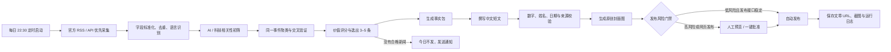

# AI 科技晚报自动化工作流蓝图

> 说明：本文是早期方案研究。当前可运行版本已经改为“自动采集候选 → 人工勾选 → 分别成稿 → 来源原图 → 填入小黑盒但不发布”，实际使用方式以仓库根目录 `README.md` 和控制台为准。早期方案中的“默认汇总”“生成原创封面”“自动发布”均未作为第一版默认行为。

## 1. 目标与默认成品

每天晚上从以下来源收集过去 24 小时的科技与 AI 新闻：Washington Post、Bloomberg Asia、Reuters、CNN、AP、BBC、Polymarket。

默认输出一篇适合小黑盒读者的中文短文：

- 3–5 条新闻，约 600–900 个汉字；
- 每条包含“发生了什么”和“为什么重要”；
- 文末保留原始来源链接；
- 生成 1 张原创横版封面图；
- 先经过事实校验和风险门禁，再进入发布环节。

内容定位不应是简单转载。小黑盒官方“文章计划”页面要求参与该激励计划的文章为“非新闻内容”，并建议 500–1500 字。因此，本工作流应把新闻加工成原创的科技观察：事实部分保持简短，把主要篇幅放在“它对玩家、开发者、硬件用户意味着什么”。纯新闻晚报即使能够作为普通内容发布，也不能默认符合文章计划的激励条件。

## 2. 推荐架构



推荐用 n8n 负责编排，用一个小型 TypeScript 服务处理抓取、聚类、校验和发布适配器，用 SQLite（单机）或 Postgres（服务器）保存状态。这样既能直观看到每一步，也不会把关键逻辑塞进难维护的可视化节点里。

## 3. 每个环节的规则

### 3.1 采集

采集优先级：

1. 官方 RSS；
2. 官方 API；
3. 获得许可的网页读取；
4. 仅保存标题、简短摘要和原文链接。

不绕过付费墙、验证码或访问控制。每条原始记录至少保存：

```json
{
  "source": "Reuters",
  "title": "...",
  "canonical_url": "...",
  "published_at": "...",
  "fetched_at": "...",
  "summary": "...",
  "access_level": "rss|api|public_page|link_only"
}
```

七个来源不能按同一种方式接入。根据各站当前官方文档和条款，建议按下表处理：

| 来源 | 在本工作流中的角色 | 推荐接入方式 |
|---|---|---|
| Washington Post | 选题雷达 | 有官方科技 RSS，但 RSS 与总条款对编辑、翻译、AI 使用和再发布有严格限制；只在许可范围内使用元数据，正式生产需取得授权 |
| Bloomberg | 商业与产业深度 | 不抓取 Bloomberg.com；使用 Bloomberg Event-Driven Feeds / Data License，并在合同中写明 LLM 与第三方发布权 |
| Reuters | 事实主干 | 采购 Reuters 的 MCP、GraphQL、RSS 或 Ready 内容流；默认条款并不自动授予 AI 改写与外部发布权，需要合同覆盖 |
| CNN | 补充背景 | 公开 Tech RSS 已不适合作为稳定日更源；使用 CNN Newsource / Content Sales 授权内容流 |
| AP | 事实主干 | 使用按客户授权的 AP Media API；如需新闻照片，另行取得图片许可 |
| BBC | 选题雷达 / 背景 | 有官方 Technology RSS；企业化、AI 改写和公开再发布应申请 Information Syndication API 或相应许可 |
| Polymarket | 热度与预期信号 | 使用公开 Gamma / Data / CLOB 读取 API；只表示市场预期，不能作为新闻事实 |

免费原型与正式生产应分开：

- 免费原型只在各站许可范围内读取标题、时间和链接做发现，不把受限媒体正文、付费内容或图片送进模型；
- 找到选题后，转向公司公告、产品博客、监管文件、论文、GitHub 等第一方材料建立事实包；
- 正式商业运行优先考虑 AP 或 Reuters 的授权数据产品，再按预算补 Bloomberg、CNN、BBC 和 Washington Post；
- 所有内容合同都要明确覆盖机器处理、LLM 摘要、中文翻译/改写、小黑盒公开发布、缓存、图片、署名、商业化和撤稿同步。

完整来源核查见配套研究笔记：`docs/research/news-workflow-sources.md`。

### 3.2 去重与事件聚类

- 清除 URL 跟踪参数，按 canonical URL 和标题指纹做第一轮去重；
- 用语义相似度把不同媒体报道的同一事件合并成一个 story cluster；
- 与最近 30 天已发布内容比较，避免连续重复报道同一件事；
- 保存每个事件的全部来源，不把多家转载误判成多方独立证实。

### 3.3 高价值评分

总分 100，默认权重如下：

| 维度 | 分值 | 判断标准 |
|---|---:|---|
| AI / 科技相关度 | 25 | 是否直接涉及模型、芯片、产品、资本、监管、安全或科研 |
| 实际影响 | 25 | 对用户、开发者、游戏、硬件或产业的影响有多大 |
| 可信度 | 20 | 是否有两家独立媒体，或“一手公告 + 一家可靠媒体” |
| 新颖性 | 15 | 相比近 30 天内容是否有实质新增 |
| 时效性 | 10 | 是否发生在过去 24 小时 |
| 小黑盒读者匹配 | 5 | 是否能转化为用户关心的具体影响 |

风险扣分：只有匿名消息源、标题党、缺少日期或关键数字无法核实、明显观点稿、重复旧闻。Polymarket 只作为“关注热度或预期变化”的信号，不作为事实证据。

建议阈值：

- 75 分及以上：进入成稿；
- 60–74 分：仅进入人工候选池；
- 60 分以下：跳过；
- 当天不足 3 条合格新闻：宁可不发，也不凑数。

### 3.4 事实包与写作

先生成机器可校验的事实包，再写文章。模型只能使用事实包，不允许凭记忆补充信息。

```json
{
  "story_id": "...",
  "verified_claims": [
    {
      "claim": "...",
      "source_url": "...",
      "published_at": "...",
      "confidence": "high|medium"
    }
  ],
  "why_it_matters": "...",
  "uncertainties": ["..."]
}
```

建议文章模板：

```text
标题：AI 晚报｜今天最值得关注的 3 件事

导语：一句话概括今天的主线。

01 事件标题
发生了什么：2–3 句。
为什么重要：1–2 句，落到普通用户、玩家、开发者或行业影响。

02 ...

今日判断：只写有证据支撑的短结论，避免夸张预测。

来源：媒体名 + 可点击原文链接
```

成稿后单独运行校验器：逐一比对公司名、人名、产品名、金额、百分比、日期和引语。任何无法回指来源的数字都删除；单一来源且敏感的消息必须标注，或转人工审核。

建议把每篇文章的原创分析占比设为至少三分之一，并在结尾给出与小黑盒受众有关的可验证影响；不要逐段翻译或拼接媒体原文。小黑盒文章计划规则见：[小黑盒文章计划说明](https://www.xiaoheihe.cn/community/creation_plan_intro?type=article)。

### 3.5 图片

默认生成原创封面，不直接搬运新闻媒体图片。封面提示词由当天主线、3 个视觉元素、配色和标题留白区组成；避免媒体 Logo、人物肖像和受版权保护的角色。

输出建议：一张 16:9 横版主图，并保留无字版。文字最好在排版阶段叠加，减少生成式图片中的错字。正式上线前应以小黑盒当前编辑器的实际裁切效果确定最终尺寸。

### 3.6 发布适配器

发布层必须独立于写作层：

```ts
interface Publisher {
  publish(input: {
    title: string;
    body: string;
    coverPath: string;
    idempotencyKey: string;
  }): Promise<{ platformId: string; postUrl: string }>;
}
```

优先顺序：

1. 小黑盒官方投稿 API 或官方内容合作通道；
2. 获得平台允许后，用 Playwright 操作网页编辑器；
3. 没有明确授权时，自动生成完整草稿与封面，由人点击发布。

截至 2026-08-06，小黑盒公开资料中未发现第三方发文 API、OAuth、Webhook 或 RSS 导入文档。官方存在登录后的运营管理平台和网页长文编辑器，但账号可能需要单独的投稿权限。因此，第一版的发布终点应明确设为“人工批准后在官方网页/App 发布”；先向小黑盒取得可留档的书面确认，再考虑无人值守浏览器发布。

网页发布器需要：

- 登录状态加密保存在仓库外，绝不提交 Cookie；
- 预览页和发布成功页各截图一次；
- 用文章内容哈希作为幂等键，防止重试造成重复投稿；
- 遇到登录失效、验证码、页面结构变化或上传失败时立即停止，不尝试绕过；
- 发布后必须读取文章 URL，并确认标题和封面存在，才标记成功。

如果后续获得允许使用网页自动化，还应遵守官方编辑器已公开的素材要求，例如单张图片小于 3 MB，并在发布后用手机端复查最终展示。官方入口与发帖指南详见来源研究笔记。

## 4. 每晚运行时序

| 时间（Asia/Shanghai） | 动作 |
|---|---|
| 22:30 | 拉取过去 24 小时内容 |
| 22:35 | 标准化、去重、事件聚类 |
| 22:42 | 相关性筛选、交叉验证、价值评分 |
| 22:50 | 生成事实包和初稿 |
| 22:56 | 事实校验、敏感项检查 |
| 23:00 | 生成封面与预览 |
| 23:05 | 自动发布或等待批准 |
| 23:10 | 验证结果并记录 URL；失败则通知 |

## 5. 状态、告警与安全

至少保存以下表：`raw_items`、`story_clusters`、`fact_packets`、`drafts`、`publish_runs`。每次运行都带唯一 `run_id`。

必须覆盖的异常：

- 单个新闻源不可用：继续处理其他来源，并记录降级；
- 合格新闻不足：不发布；
- 生成结果缺来源或超字数：自动重写一次，仍失败则停止；
- 图片生成失败：使用预先准备的中性模板图；
- 小黑盒登录失效或页面变化：进入待人工发布队列；
- 发布请求超时：先检查历史记录，确认未发布后才能重试。

账号密码、API Key、Cookie 和发布凭据放在 n8n Credentials 或系统密钥存储中。日志不得记录完整 Cookie、Token 或个人信息。

## 6. 上线节奏

### 阶段 A：影子运行（7 天）

每天自动产出候选新闻、文章和封面，但不发布。人工给每条候选标记“值得 / 不值得”和原因，用来调权重、文风与长度。

### 阶段 B：一键审核发布（7–14 天）

自动完成全部内容，人工只看预览并批准。这一阶段重点观察事实错误、重复选题、封面裁切和平台编辑器稳定性。

### 阶段 C：条件自动发布

只有满足以下条件才自动发布：总分不低于 75、关键事实均有来源、没有敏感或单一来源内容、发布适配器健康。其余文章仍走人工批准。

### 阶段 D：全自动

仅在确认平台允许自动投稿、连续运行稳定且已有回滚与告警后启用。即使全自动，也保留“当天不发”的出口和一键停机开关。

## 7. 第一版实施范围

第一版建议只做：

- 先接入 3 个采集最稳定的来源，再逐个增加；
- 每天 1 篇、3 条新闻、1 张封面；
- 最近 30 天去重；
- 强制保留来源链接；
- 使用人工批准发布；
- 记录每次运行的输入、输出和失败原因。

第一版稳定后，再增加全部 7 个来源、读者反馈学习、自动 A/B 标题和条件自动发布。
