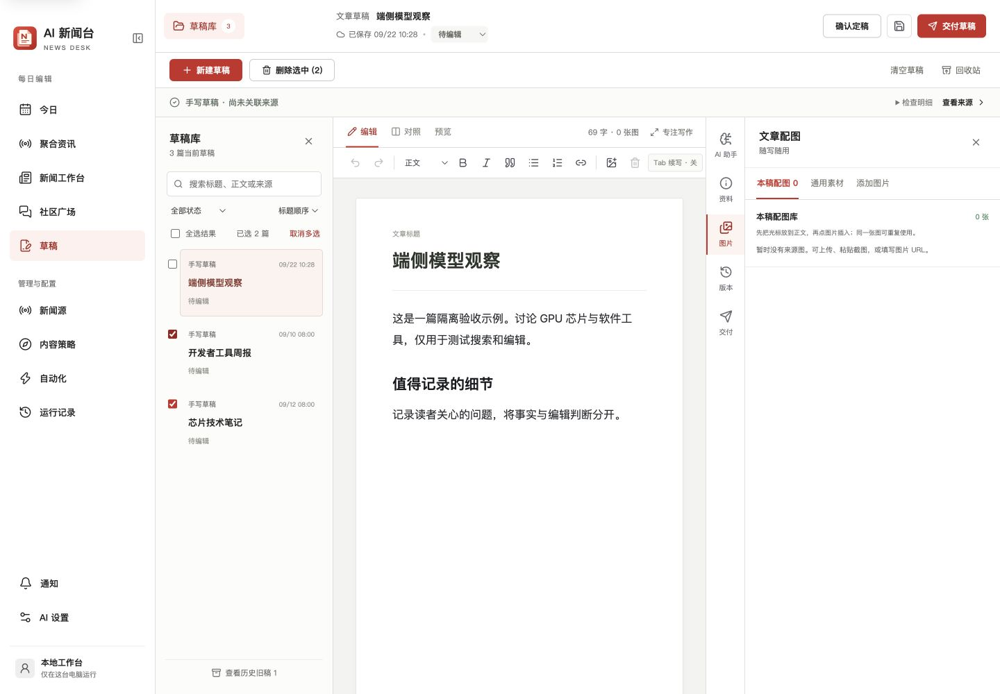
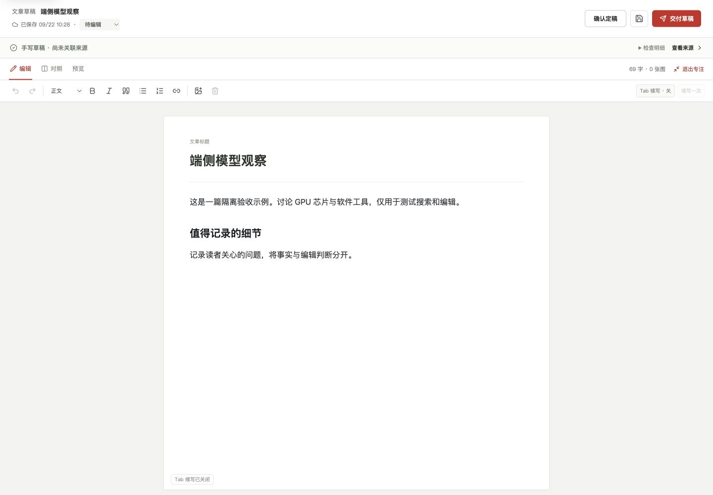

# 草稿体验审查与实施路线 · 2026-09-22

依据：已运行的 Mac App、DraftWorkspace、DraftLibraryActions、RichArticleEditor、DraftEvidencePanel、DraftQualityPanel 与现有浏览器回归。保留红白风格、现有一级导航、自动保存、冻结事实与人工发布边界。

## 发现与分期

| 顺序 | 实际问题 | 改造与验收标准 |
| --- | --- | --- |
| 1 · 本轮 | 管理只有单篇删除和全库清空 | 列表可多选、全选筛选结果、确认后删除选中项；改变筛选清掉选择，避免隐藏项被误删。回收站支持搜索和恢复当前搜索结果。 |
| 1 · 本轮 | 正文搜不到，排序固定 | 搜索覆盖标题、来源、正文；按修改时间、创建时间或标题排序；无匹配时可以清除筛选。 |
| 1 · 本轮 | 重开 App 回到第一篇 | 记住上次编辑稿；已删除 ID 自动回退；历史稿也能正确打开；本机存储受限时仍可编辑。 |
| 1 · 本轮 | 编辑页顶栏与侧栏占据写作空间 | 增加显式“专注写作”和“退出专注”；临时收起导航与管理区，保存状态与事实提醒仍可见，Esc 退出后恢复原布局。默认管理按钮不隐藏。 |
| 1 · 本轮 | 添加图片、27 张通用素材排在本稿图片前 | 图片分为“本稿配图／通用素材／添加图片”，优先显示本稿配图；切换不清空输入，不修改权利判断。 |
| 2 | 空白手写稿没有清晰的补充来源路径，资料面板在无证据时仍出现肯定口吻 | 设计“关联已有素材包／添加待核对来源”流程；链接不自动等于已读证据；统一无来源、未读、待核对、规则已检查的文案。新增事实必须重新绑定冻结材料。 |
| 2 | 当前版本核对、资料、下一步、交付预检重复呈现问题 | 统一成三组：阻断交付、待人工判断、可选改进；每项能定位正文或图片。保存后旧结论明确失效；规则通过不能显示为人工审稿完成。 |
| 2 | 历史列表用修订编号和恢复按钮，比较成本高 | 先预览版本差异再恢复；明确“恢复前自动备份”。保留初稿／确认稿，折叠连续自动快照；差异覆盖标题、正文、图片及来源。 |
| 2 | 多平台设置和回执占用交付面板，当前稿与已同步稿不易比较 | 微信优先，直接呈现“未同步／已同步／修改后待更新”；其他平台按需展开。同步失败给出具体步骤与重试入口，版本冲突不强行覆盖。 |
| 3 | 长文缺乏快速导航，复制与导出入口分散 | 加文章目录、正文查找、统一复制纯文本／公众号排版与 Markdown 导出。先保证图片说明与出处保留，再考虑导入复杂文档。 |
| 3 | 缺少分支稿与轻量归档 | 复制草稿作为独立备选，重置交付回执和确认状态；保留原稿关联。置顶／归档只改变管理顺序，不更改事实评分。 |

## 页面组织

常规模式保持“草稿库—正文—按需工具”。管理动作和正文操作分层：新建、删除、清空、回收站在草稿页上方；筛选、排序、多选在草稿库；编辑、预览、专注在正文上方。配图先显示本稿可用素材。专注模式是主动切换的写作视图，退出入口常驻，不改变用户侧栏偏好。

本轮不增加模板市场、文件夹树或更多 AI 开关。后续按“可发现 → 少打断 → 能核对 → 可恢复”验收，不能用更多按钮替代缺失的完整流程。

## 验收范围

所有写入、批量删除和恢复使用独立测试目录；正式库只读核对。测试覆盖搜索／筛选作用域、多窗口版本冲突、切换前保存、清空后恢复、最后编辑稿记忆、存储受限、专注往返与 1440／820／390／320 宽度。交付行为仍仅同步草稿箱，由用户手动发布。

## 本轮验证记录

- 本地 `npm test`：1108/1108；`npm run eval:editorial`：22/22；TypeScript 与生产构建通过。
- 隔离浏览器实测：全角正文关键词搜索；筛选变化清空选择；按标题排序；删除选中项与确认名称；按搜索结果恢复且保留其他回收站条目；恢复后刷新仍打开该稿。
- 1440 桌面与 320 手机验收专注模式，退出按钮、Esc 和保存状态可用；320 页面无横向溢出。配图分类切换保留尚未提交的图片 URL。
- 自动浏览器回归追加上述流程，CI 结果以 PR 最新提交为准。第二、三阶段仅规划，未作为本轮已实现功能。

### 实际页面（隔离示例数据）

