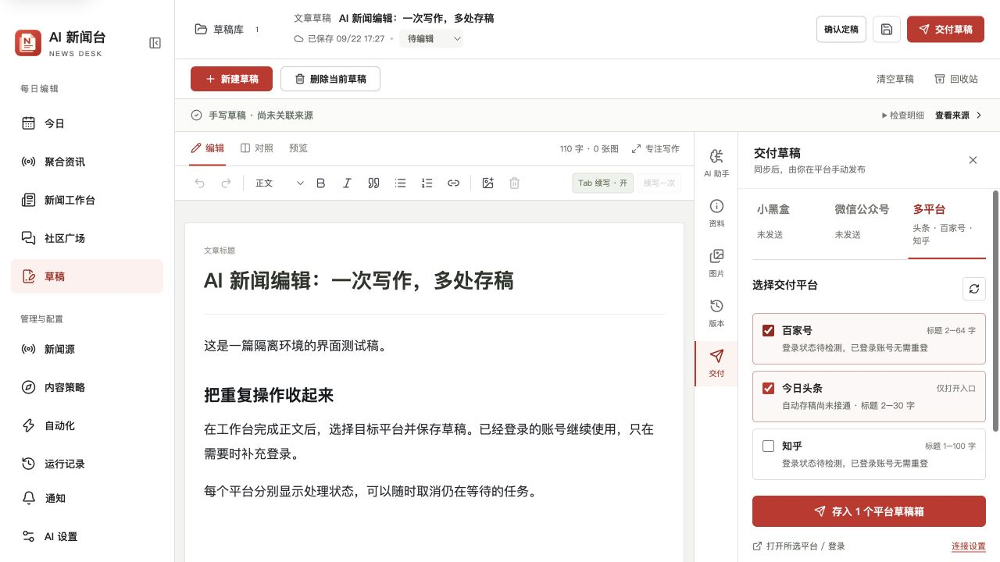
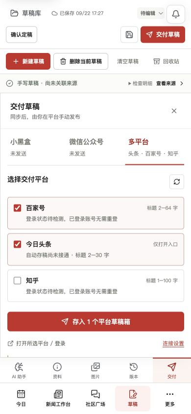

# 多平台草稿交付 · 2026-09-22

## 当前入口与行为

在草稿编辑器打开“交付草稿 → 多平台”。百家号、今日头条、知乎的入口成为一级标签页，不再藏在其他平台折叠区。记住上次勾选的平台，主按钮显示实际可自动存稿的平台数量。头条可参与“一次打开”，但明确标注“仅打开入口”，不计入自动存稿数量。

- 百家号：[图文编辑器](https://baijiahao.baidu.com/builder/rc/edit?type=news&is_from_cms=1)，标题 2–64 字。修复原先 1–30 字的误拦，不截断或改写标题。
- 今日头条：[文章编辑器](https://mp.toutiao.com/profile_v4/graphic/publish)，标题 2–30 字。用户截图确认页面有自动保存提示；该提示本身不能证明实际远端草稿已保存。
- 知乎：[文章编辑器](https://zhuanlan.zhihu.com/write)，沿用现有同步助手渠道。

“打开所选平台 / 登录”使用普通 Chrome 的现有登录环境，不创建调试浏览器，不导出或复制 Cookies。点击存稿会保存本地文章、打开所选编辑入口，并建立每个平台独立的持久任务。百家号和知乎等待连接或登录，检测成功后继续原任务；有效回执返回后在 Chrome 打开实际草稿链接。没有最终发布操作。

网站登录与同步助手连接分别显示。桥接断线、认证检测失败显示“登录状态待检测”，只有平台明确返回未登录才要求登录。已保存的扩展连接信息默认折叠，日常只保留平台状态与打开入口。

## 交付约束

任务冻结稿件版本、目标平台和已识别的账号标识。等待期间正文变化、已绑定账号变化、等待超过 10 分钟都会停止该目标，需重新点击交付。首次未登录时绑定用户随后登录的账号。取消仅取消未发送的目标；已经开始的存稿等待回执。页面刷新能恢复任务进度。

发送中的任务先落盘，远端存稿仍由原有 DeliveryDesk 执行事实、图片权利、文件指纹、账号和幂等校验。同一账号同一版本复用原回执；未知结果阻止直接重试。进程重启时根据持久回执恢复发送结果，不重新发送不确定的请求。移入回收站会取消等待任务；正在发送的稿件暂不能删除，恢复草稿也不会恢复已取消的交付。

“助手返回草稿回执”与“已回读验证内容”仍有区别。百家号、知乎当前只得到助手回执，需用户在打开的草稿中核对。头条自动填入与远端保存回读尚未实现，不能把已登录标为已接通。微信、小黑盒保留各自现有流程，本轮的多选队列只覆盖百家号、知乎和头条入口，尚未合并所有平台为同一个任务。

## 验证与剩余工作

- 本地 `npm test` 1145/1145、编辑评测 22/22、构建通过（后续最终检查见提交记录）。
- 回归覆盖百家号标题边界、未知登录状态、连接/登录自动续接、平台失败隔离、取消与并发、内容/账号变更、过期、重启恢复、回收站恢复。
- CUA 隔离环境验证桌面、390 与 320 像素宽度，无横向溢出；等待任务可恢复，取消后编辑器解除锁定。测试稿在独立临时数据目录，没有修改正式草稿。
- 新增远端 CI 的界面测试覆盖平台选择、头条计数排除、刷新恢复与取消。界面测试模拟远端行为，不是平台线上验收。
- 当前 Chrome 操作连接多次超时，无法读取真实头条/百家号编辑器。因此还未用真实稿件验收自动填入与草稿保存，没有向这些平台发送测试文章。

下一步先恢复 Chrome 操作连接，验证百家号真实草稿、账号与图片；再为头条实现只保存草稿的独立适配，取得远端草稿 ID 并回读标题、正文、配图与封面。不能通过放开尚未核验的同步助手私有适配器来冒充接通。

## 后续平台优先级

按 AI 科技内容的适配性建议：先知乎长文，再小红书的工具教程/多图卡片，最后 B 站的实操演示。该顺序是产品判断，不是平台流量排名。小红书官方[分享开放平台](https://agora.xiaohongshu.com/)公开支持图文与视频分享；B 站[创作中心](https://member.bilibili.com/)可作后续视频交付入口。B 站 2026 年第二季度日活 1.165 亿，见公司向 SEC 提交的[季度业绩公告](https://www.sec.gov/Archives/edgar/data/1723690/000119312526371261/d434015dex991.htm)。代码类教程可再考虑掘金、CSDN，不把所有新闻原样分发到所有平台。
