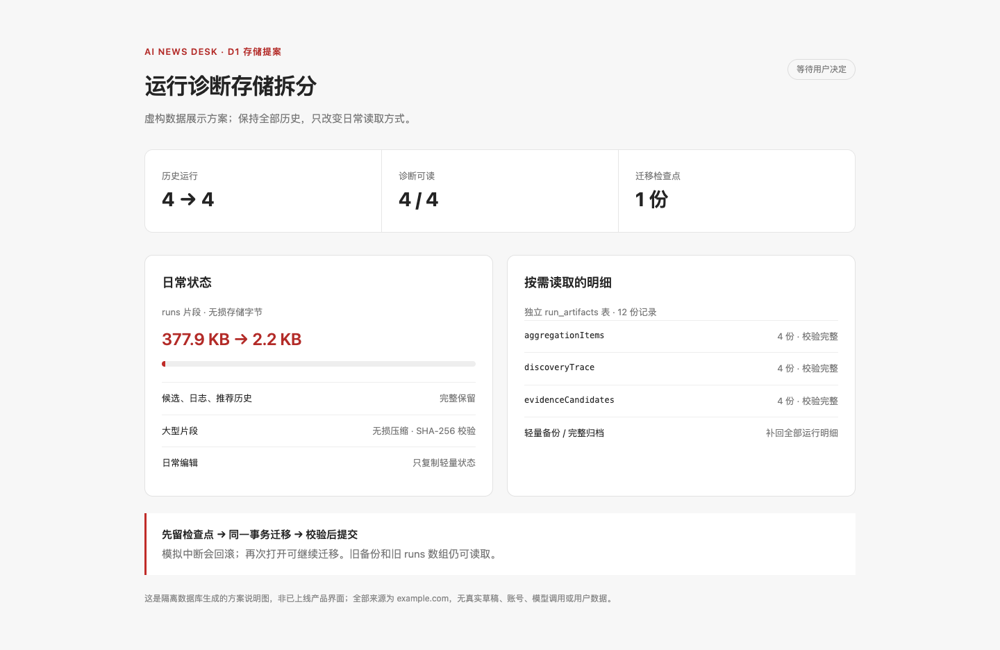
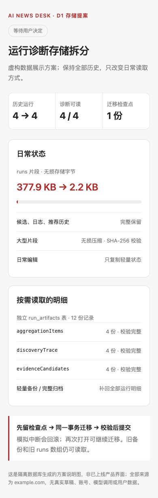

# D1：运行诊断存储分离提案

此 PR 完整实现并验证，但保持打开，不合并、不上线。所有实测只在新建临时数据库和既有只读备份的独立副本上进行，没有启动真实数据库副本的完整服务。

日常状态只保留候选、日志、推荐历史等轻量内容。`run_artifacts(run_id, kind, json, checksum, updated_at)` 保留 `discoveryTrace / evidenceCandidates / aggregationItems`；三种明细按需读取，返回独立副本。同一次 Story/社区投影只读每份明细一次，避免每个候选重复复制整份路径。原始标题、URL、事实、图片来源、稿件和回执不变。

| 指标 | 改动前 | 改动后 |
| --- | --- | --- |
| 同口径串行副本空更新，11 次 | 111.0–127.8 ms；中位 111.8 ms | 29.2–33.5 ms；中位 29.6 ms |
| runs 存储片段 | 15,661,832 B | 887,712 B |
| 去除明细后的逻辑 JSON | — | 3,286,587 B，完整保留 |
| 运行 / 诊断可读 | 62 / 62 | 62 / 62 |
| 独立明细记录 | 0 | 41；历史未记录字段保持缺失，不补造数据 |
| 同一视图、200 个隐藏候选的路径读取 | 200 次 | 1 次 |
| 状态、今日/聚合/社区/路径/报告/诊断与其他七张表 | — | 全部逻辑校验摘要相等 |

原计划是 64 次运行和 140–240 ms，本副本现状是 62 次。这里只发布合计数字与相等性，原始文章、来源、账号和数据库不提交。详见 [副本实测](copy-measurements.json) 和 [全部读写点](../../../architecture/run-artifact-read-write-audit.md)。

“低于 3 MB”按存储片段字节验收：单纯移出明细后仍有 3.29 MB。没有削减候选、日志或推荐历史；大型 runs 使用 gzip level 1 的无损表示，旧数组仍可读。压缩层有物理行 SHA-256、解压后的 SHA-256、明确字节数、规范 base64 和 128 MiB 输出上限；超大旧历史写入保留原数组，不能为达标删数据。其他片段不压缩。

首次打开旧库会先只读校验旧字节，再建立 `VACUUM INTO` 检查点，然后在同一事务内升级、拆分和校验。注入中断证明 schema/state 回滚，检查点保持可用；正常再次打开不会重复搬迁。完整旧快照恢复在事务内重新拆分并校验，新快照带上新表。恢复也补齐了后台任务 lane 列的往返保存，旧快照缺少该列时保留原兼容默认。

写回时，轻量状态中没有字段表示保留旧明细；显式空数组表示清空该字段；显式 undefined 表示移除。只对明确的整份状态恢复清除不再属于导入状态的明细；普通编辑不裁剪历史行。隐藏证据编辑、摘要写回、留作选题、反馈与图片补全继续走原领域接口。轻量备份补回全部已记录运行明细，完整归档含全表，原本机路径与图片 SHA-256 检查原样。

待决定的是 schema 7 迁移与这个无损 runs 表示。C4 独立 PR 也从 schema 6 提议升级到 7；若两个方案都批准，第二个必须重新基于最新 main 整合为 schema 8、合并两张新表的备份逻辑并重跑四项与双 CI，不能直接叠加这两个独立 PR。

测试包括旧库/旧整行状态迁移、两次重入、中断回滚、显式编辑/空值、缓存外部修改和事务失败、压缩破坏/长度炸弹、旧/新快照、后台任务字段、轻量与完整归档往返、纯视图相等、隐藏来源/图片 Story 读取和只读 CLI。B1 原有存储回归只接入新读取参数，所有原断言保留。

时延不是负载下的硬保证：与其他检查并行的初轮测量出现 58–126 ms；上表使用串行同口径测量。首次旧库迁移加完整状态补回为约 473 ms，包含一次性检查点成本，不作为冷读提速结论。本轮没有真实模型调用或平台发送。

下面是 4 次虚构采集的存储方案图，由真实临时数据库生成，**不是产品界面或真实数据截图**。1440/390 宽均无横向溢出、控制台错误或外部请求。可用 `node --import tsx scripts/ui-preview/run-artifacts.mjs` 重现。

最终本地四项：单测 1407/1407，编辑黄金集 22/22，隔离构建成功，隔离 E2E 13/13，0 失败、0 跳过。CI 以 PR 最终提交的 verify 和 windows-desktop 为准；通过后仍保持打开。
