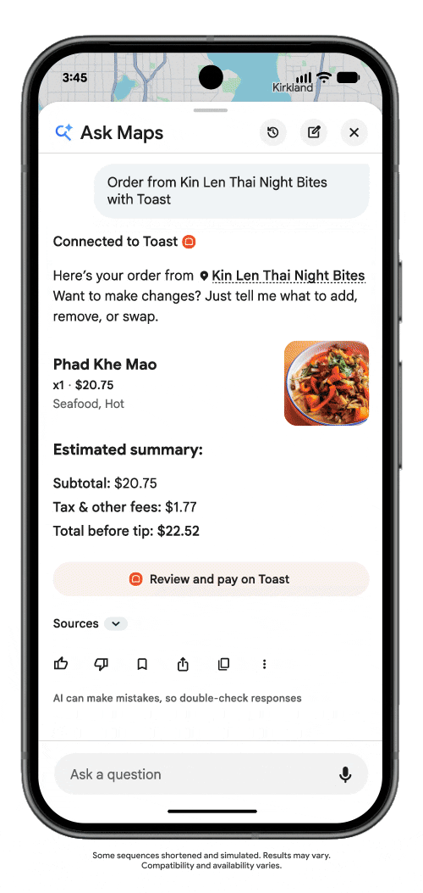
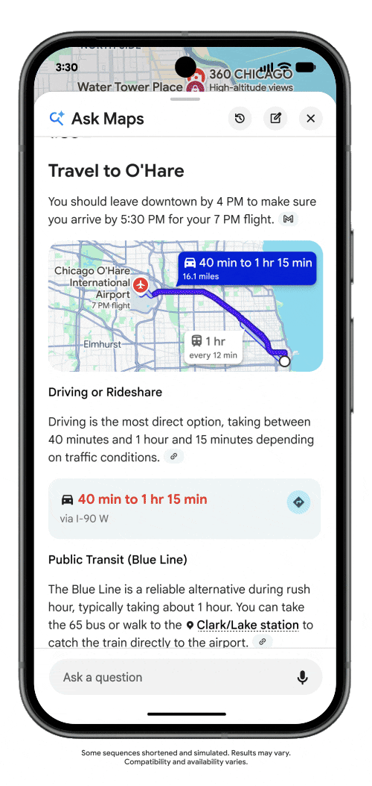

# Google Maps开始替你点餐，地图正在变成行动助手

Google 正在给 Google Maps 的 Ask Maps 加上一批智能体能力：用户可以直接用自然语言找餐、筛选酒店或查找演出门票，而不必自己在地图、搜索和第三方平台之间反复切换。据 TechCrunch 报道，这批功能正在美国推出。

点餐时，用户可以直接描述想吃什么，Ask Maps 会查找附近餐厅并整理候选。选定餐厅后，它能把商品加入购物车，再把支付环节交给 Square、Toast 或 Uber Eats 等合作平台完成。Google Maps 负责理解需求和组织订单，但最终交易仍由商家平台处理。

*图 1：Ask Maps 已把菜品、价格和费用整理成订单，用户需要前往 Toast 检查并支付。截图取自 Google 提供、TechCrunch 刊载的产品 GIF。*

Ask Maps 还可以按预算、评分、位置和风格查找酒店，比较价格和空房后，把用户带到合作方网站完成预订；演出和现场活动也采用类似方式，先给出选项，再提供购票链接。

同时加入的 Personal Intelligence 可以在用户主动开启后读取 Gmail 和 Google Calendar 中的行程信息，用来回答航班落地时间、酒店周边安排等问题。该功能默认关闭；Ask Maps 还会记住之前的对话，并增加实时公共交通状态组件。

*图 2：Ask Maps 结合航班时间给出出发建议和驾车、公共交通选项。截图取自 Google 提供、TechCrunch 刊载的产品 GIF。*

**我的判断：**这次更新真正重要的不是 Maps 又多了一个聊天框，而是 Google 正在把“查询地点”推进到“代你完成现实任务”。它是否好用，最终要看能否稳定减少操作步骤；而 Gmail、Calendar 与地图位置一旦串联，权限提示、错误恢复和用户确认会比回答得像不像人更重要。

## 来源

- [TechCrunch：Google Maps adds agentic features, including food ordering and hotel bookings](https://techcrunch.com/2026/08/06/google-maps-adds-agentic-features-including-food-ordering-and-hotel-bookings/)
- [Google 官方：Ask Maps 与 Immersive Navigation](https://blog.google/products-and-platforms/products/maps/ask-maps-immersive-navigation/)
- [Google 官方：UCP 与点餐、酒店预订方向](https://blog.google/products-and-platforms/products/shopping/shopping-updates-google-marketing-live/)

## 图片审计

- 原报道共有 1 张 Getty 头图和 2 张正文产品 GIF。
- Getty 头图未使用，因为其授权属于 TechCrunch，不能推定可二次发布。
- 正文 2 张 GIF 的图注均标明 `Image Credits: Google`，本稿按原顺序使用两张代表性静态帧。
- 原始素材保存在 `assets/food-ordering-source.gif` 和 `assets/personal-intelligence-source.gif`，发布版使用体积更小的 PNG 截图。
- 图片发布时应标注“来源：Google，经 TechCrunch”；正式商用前仍需核对 Google 的媒体素材使用条款。

## 发布前待确认

- 当前点餐、酒店和票务能力的具体覆盖范围可能因地区、账户和合作平台不同而变化。
- Personal Intelligence 默认关闭，稿件不能暗示 Google 会自动读取所有用户邮件和日历。
- 本轮未进入小黑盒编辑器，也未点击发布。
